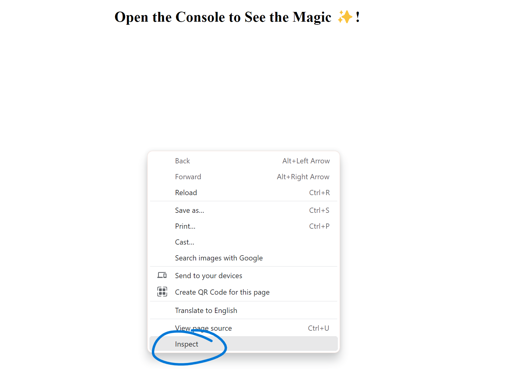
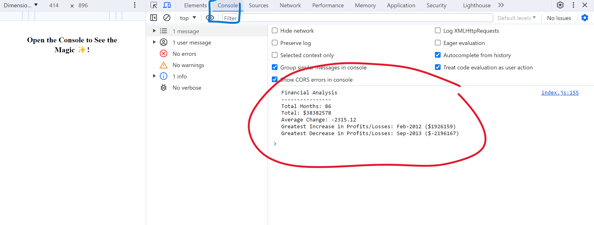

# Console Finances

I have been tasked with creating a code for analyzing the financial records of a company. I was provided with a financial dataset.

To complete this I will calculate:

* The total number of months included in the dataset.

* The net total amount of Profit/Losses over the entire period.

* The average of the **changes** in Profit/Losses over the entire period.

* The greatest increase in Profit/Losses (date and amount) over the entire period.

* The greatest decrease in Profit/Losses (date and amount) over the entire period.

## Installation

To open the project please follow this link: https://anamorai.github.io/Console-Finances/

## Usage 

Once you open the URL, you will need to open the console log. To do this please right click on the page and click 'Inspect'. It will look like this.

Following that, please ensure you open the console log to view the information. Once you have selected console (highlighted in blue on the image below) you will see the information calculated (highlighted in red in the image below): 

## Badges

## Features

- Calculations in the console log that analyzes the financial records of a company.

## Credits

I would like to give credit to EdX bootcamp and the tutors associated for the support I have recieved for this project. 
I would like to give specific credit to my tutor, Samuel Cordova for helping me to understand javascript in more depth. 
I would also like to give credit to the forums on stackoverflow for the useful threads on javascript functions and commands.

## License

MIT License

Copyright (c) [2023] [Anastasia Moraites]

Permission is hereby granted, free of charge, to any person obtaining a copy
of this software and associated documentation files (the "Software"), to deal
in the Software without restriction, including without limitation the rights
to use, copy, modify, merge, publish, distribute, sublicense, and/or sell
copies of the Software, and to permit persons to whom the Software is
furnished to do so, subject to the following conditions:

The above copyright notice and this permission notice shall be included in all
copies or substantial portions of the Software.

THE SOFTWARE IS PROVIDED "AS IS", WITHOUT WARRANTY OF ANY KIND, EXPRESS OR
IMPLIED, INCLUDING BUT NOT LIMITED TO THE WARRANTIES OF MERCHANTABILITY,
FITNESS FOR A PARTICULAR PURPOSE AND NONINFRINGEMENT. IN NO EVENT SHALL THE
AUTHORS OR COPYRIGHT HOLDERS BE LIABLE FOR ANY CLAIM, DAMAGES OR OTHER
LIABILITY, WHETHER IN AN ACTION OF CONTRACT, TORT OR OTHERWISE, ARISING FROM,
OUT OF OR IN CONNECTION WITH THE SOFTWARE OR THE USE OR OTHER DEALINGS IN THE
SOFTWARE.